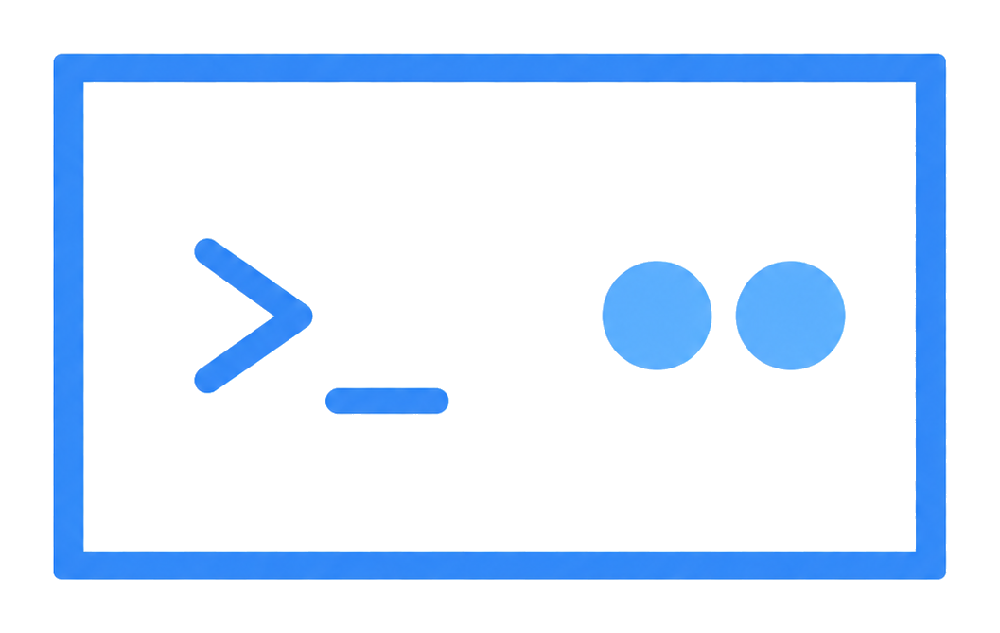

<p align="center">
  
</p>

<h1 align="center">artui</h1>

<p align="center">
  A Rust terminal coding-agent TUI built with ratatui.
</p>

artui is designed around explicit tool use, bounded output, approvals, diffs, and logs instead of a generic chat window.

## Quick Start

Install Rust, then run:

```bash
cargo run
```

Optional local model setup:

```bash
ollama serve
ollama pull gemma4:e2b
```

By default, artui uses Ollama at `http://localhost:11434` with `gemma4:e2b`.

Useful checks:

```bash
cargo fmt --check
cargo check
cargo clippy -- -D warnings
cargo test
```

## Tech Stack


- **Language:** Rust 2021
- **Terminal UI:** ratatui + crossterm
- **Async runtime:** Tokio
- **HTTP streaming:** reqwest
- **Config:** TOML via serde
- **LLM providers:** Ollama first, OpenAI-compatible HTTP skeleton
- **Primary target:** Linux/Fedora first, with Windows/macOS compatibility where practical

## Configuration

Global config path:

```text
~/.config/artui/config.toml
```

Minimal example:

```toml
default_provider = "ollama"

[providers.ollama]
host = "http://localhost:11434"
default_model = "gemma4:e2b"
```

## Documentation

- [v1 Agentic Spec](docs/spec/artui_v1_agentic_spec.md)
- [Spec Index](docs/spec/README.md)
- [Changelog](docs/changelogs/CHANGELOG.md)
