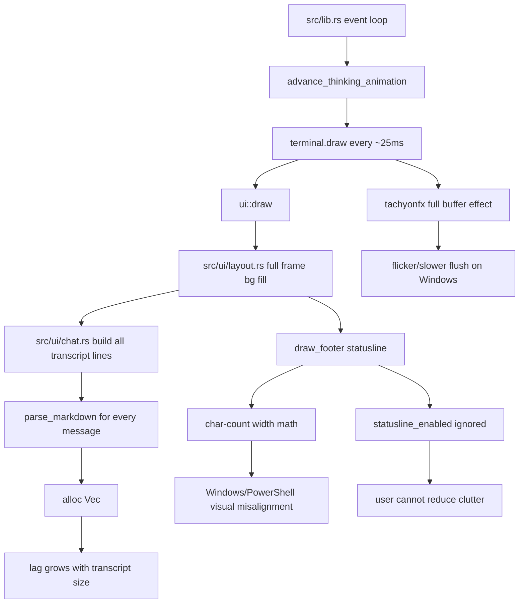

# Code Review: CR-TERMINAL-WOLF

Cross-platform TUI performance, Windows flicker, statusline layout, and memory-growth review.

## Scope

- User report: older Windows builds flicker in PowerShell, statuslines become visually messy, and overall UI feels laggy.
- Platforms: Windows PowerShell / Windows Terminal / legacy conhost, plus Linux terminal emulators.
- Files reviewed:
  - `src/lib.rs`
  - `src/app.rs`
  - `src/ui/layout.rs`
  - `src/ui/chat.rs`
  - `src/ui/popups.rs`

## Quick verdict

No obvious hard memory leak found (`Box::leak`, `mem::forget`, `static mut`, etc. not present in the checked UI path).

But there are several **real performance/memory-growth risks**:

- UI redraws too often, even when nothing changed.
- Full transcript is re-parsed and re-allocated every frame.
- Statusline config exists but the footer renderer does not use it.
- Width math uses character counts, not terminal cell width; this can break statuslines, especially with Unicode glyphs on Windows.
- Transcript/images grow for the whole session; not a leak, but memory can climb over long sessions.

## Graphify: hot path + risk map



## Findings

### 🟡 P2 — Render loop redraws full UI every 25ms

- **Location:** `src/lib.rs:171-185`, `src/lib.rs:222`
- **Problem:** The main loop draws the full UI every pass, then polls input for 25ms. That is roughly 40 FPS even when idle.
- **Impact:** Windows terminals, especially PowerShell/conhost, can flicker or feel laggy because full-frame flushes are expensive.
- **Fix:** Add a dirty-frame scheduler:
  - Draw immediately after app events, input, resize, paste, model tokens, or status changes.
  - Draw on animation ticks only while streaming/thinking.
  - Use lower default Windows animation FPS, e.g. 8–12 FPS.
  - Consider `BeginSynchronizedUpdate` / `EndSynchronizedUpdate` where supported.

### 🟡 P2 — Chat renderer re-parses the whole transcript every frame

- **Location:** `src/ui/chat.rs:14-58`, `src/ui/chat.rs:315`, `src/ui/chat.rs:528`
- **Problem:** Each draw rebuilds all `Line`/`Span` values and calls `parse_markdown()` for every message.
- **Impact:** CPU and allocations scale with full session history. Long chats will get slower on Windows and Linux.
- **Fix:** Cache rendered message lines by message id/content hash, invalidate only changed messages, and render only the visible viewport plus small overscan.

### 🟡 P2 — `/statusline` toggles are not applied to the footer

- **Location:** `src/app.rs:532`, `src/app.rs:1263-1285`, `src/ui/layout.rs:554-589`
- **Problem:** `statusline_enabled` is toggled by the picker, but `draw_footer()` hardcodes cwd/git/context output and does not check enabled items.
- **Impact:** Users cannot reduce clutter. Footer can overflow/misalign, matching the reported “statuslines are messed up.”
- **Fix:** Build footer spans from `StatusLineItem::ALL` and `app.statusline_enabled`. Enforce a width budget and hide low-priority items first.

### 🟡 P2 — Width math uses chars, not terminal cell width

- **Location:** `src/ui/layout.rs:541-552`, `src/ui/layout.rs:624`, `src/ui/layout.rs:656`
- **Problem:** `trim_to_width()` and title width math use `.chars().count()`. Terminal layout needs display-cell width.
- **Impact:** Unicode glyphs (`█`, `░`, `…`, eye frames, separators) can render with different widths in Windows PowerShell/conhost, causing statusline drift.
- **Fix:** Use `unicode-width` for truncation and area widths. Add ASCII fallback glyphs for Windows/legacy terminals.

### 🟠 P3 — Full-screen background fill + full-buffer effect increase flicker risk

- **Location:** `src/ui/layout.rs:18-21`, `src/lib.rs:180-184`
- **Problem:** Each frame paints a full-screen background block and runs `tachyonfx` over the full buffer.
- **Impact:** More terminal cells change per frame, worsening flicker on slower terminals.
- **Fix:** Reduce full-screen effects, limit animation to small regions, and disable fancy effects by default on Windows unless user opts in.

### 🟠 P3 — Session memory grows without bounds

- **Location:** `src/app.rs:550-551`, `src/app.rs:860-876`
- **Problem:** `transcript`, pasted images, and cloned `model_messages` can grow large. This is not a leak, but memory can climb during long sessions.
- **Impact:** Long chats with images or large pasted/file-expanded content can increase RAM and clone cost.
- **Fix:**
  - Add transcript compaction/pruning for UI-render cache.
  - Store images as `Arc<[u8]>` instead of repeatedly cloning `Vec<u8>`.
  - Add max paste/image size and count.
  - Keep provider context separate from UI display transcript.

## Platform optimization plan

### Windows

1. Add dirty-render loop; avoid idle 40 FPS redraw.
2. Default fancy effects off or low-FPS on Windows.
3. Add synchronized update wrapper when supported.
4. Add ASCII-safe glyph mode:
   - context bar: `########--`
   - spinner: `- \ | /`
   - separators: `|`
5. Use `unicode-width` for all footer/header truncation.
6. Test in:
   - PowerShell 5 + conhost
   - PowerShell 7
   - Windows Terminal

### Linux

1. Keep animations, but dirty-render still applies.
2. Add render benchmark with large transcript.
3. Profile allocations with `heaptrack` or `valgrind --tool=massif`.
4. Validate no terminal artifacts in common emulators:
   - GNOME Terminal
   - Konsole
   - Alacritty
   - WezTerm

## Suggested validation commands

```bash
cargo fmt --check
cargo clippy --all-targets -- -D warnings
cargo test --lib
```

Linux memory/perf:

```bash
heaptrack target/debug/artui
valgrind --tool=massif target/debug/artui
```

Windows smoke:

```powershell
cargo run --bin artui
```

Manual checks:

- Start idle app for 60s: CPU should stay low.
- Stream long response: no visible flicker.
- Toggle `/statusline`: footer items should actually hide/show.
- Resize terminal narrow/wide: no broken footer alignment.
- Run long chat: render latency should not grow linearly with full transcript size.

## What current implementation does best

- Uses ratatui/crossterm cleanly with alternate screen and raw-mode restore.
- Mouse capture is off by default, preserving native terminal copy behavior.
- Has a dedicated statusline picker state and item enum ready for a proper renderer.
- Keeps UI modules split (`layout`, `chat`, `popups`), so fixes can stay narrow.

## What it does not do well

- Renders too often and too much.
- Mixes session storage with render workload.
- Computes layout width using characters instead of terminal display cells.
- Adds `/statusline` UI state without applying it to the actual footer.
- Uses visually rich Unicode/effects without Windows-safe fallbacks.

## How to improve without breaking current changes

1. First fix statusline correctness:
   - Wire `statusline_enabled` into `draw_footer()`.
   - Add width-budget truncation using `unicode-width`.
2. Then fix render scheduling:
   - Add `dirty` flag and animation deadlines.
   - Keep old 25ms poll as fallback only while streaming.
3. Then add render caching:
   - Cache parsed/rendered transcript lines.
   - Invalidate only last assistant message while streaming.
4. Then add platform presets:
   - Windows: low animation FPS + ASCII glyphs + reduced effects.
   - Linux: normal glyphs/effects, still dirty-rendered.
5. Finally add memory caps:
   - Bound pasted images/text.
   - Use `Arc<[u8]>` for image payloads.
   - Add long-session compaction for UI transcript.

## Status

**Implemented** (2026-06-02): dirty-render loop, transcript line cache, statusline toggles wired, `unicode-width` truncation, Windows ASCII presets (`terminal_preset`), effects off on Windows unless `ARTUI_EFFECTS=1`, paste/image caps.

Residual (not in this pass): `Arc<[u8]>` for image payloads; synchronized terminal updates; viewport-only transcript rendering.

